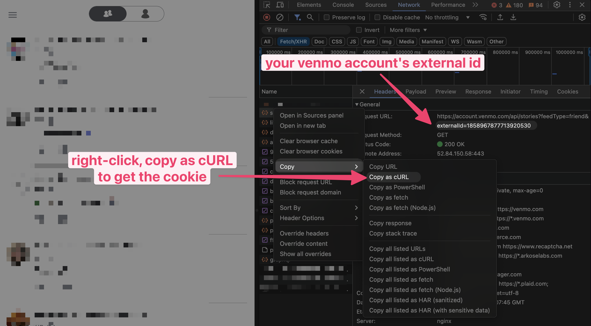

# Extract Venmo Transactions

This script extracts all the transactions from a Venmo account and saves them in a CSV file. The script uses the Venmo API to extract the transactions and saves them in a CSV file.

> [!NOTE]
> Venmo API requires authentication to access the transactions. You will need to copy the cookie from a logged-in Venmo session to authenticate the script.

## Usage

> [!WARNING]
> You will need to extract your externalId and get a cookie from a logged-in Venmo session to use this script.
>
> - The externalId is static and can be preserved for future use.
> - The cookie is dynamic and will need to be updated when it expires.



```shell
go run main.go <external_id> <stop_transaction_date> <cookie>
```

```shell
# Get all transactions from today to 2021-01-01
go run main.go 1234567890 2021-01-01 "cookie"
```
